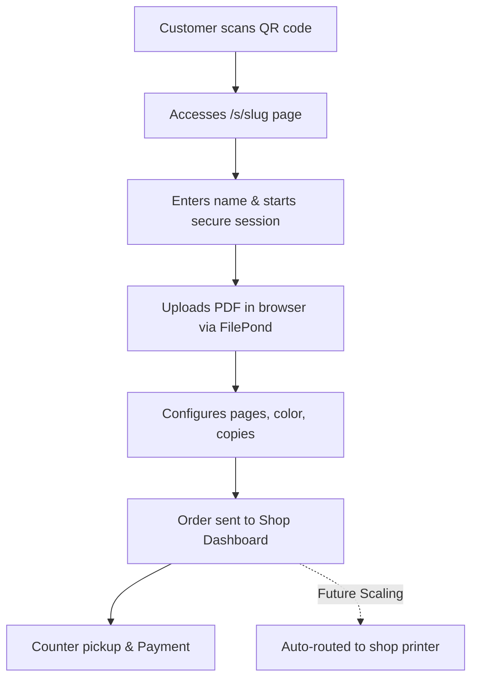
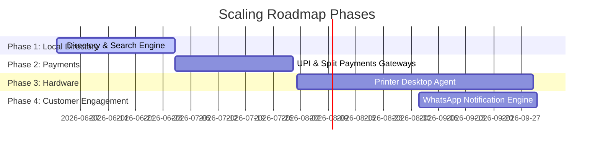

# Scan2Paper (SmartPrint App) - Complete Project Report & Strategy

This comprehensive report details the current system status of **Scan2Paper** (SmartPrint App), its underlying technical architecture, recently implemented production and SEO enhancements, core storage and performance audits, and a strategic roadmap to scale the project into a highly competitive commercial SaaS platform.

---

## 1. Project Vision: "Self-Service Smart Print Cloud"

Scan2Paper bridges the gap between walk-in customers and print shops. Instead of copying files to USB drives or sending PDFs via insecure email/WhatsApp chats, customers can scan a QR code at the shop counter, upload their documents securely in their mobile browser, configure print properties (color, pages, copies), and pay instantly. The document is automatically queued on the print shop's dashboard and can be routed directly to local print queues.

---

## 2. Technical Architecture & Tech Stack

Scan2Paper is built on a modern, Edge-ready, serverless tech stack optimized for performance, security, and developer velocity.

### Technology Blueprint

| Layer | Technology | Purpose |
| :--- | :--- | :--- |
| **Frontend Framework** | **Next.js 14.2 (App Router)** | Hybrid Server/Client rendering, server actions, dynamic routing |
| **Language** | **TypeScript** | End-to-end type safety, reliable refactoring |
| **Authentication** | **Clerk** | Secure identity provider, multi-tenant session management |
| **Database** | **Supabase (PostgreSQL)** | Relational data, real-time sync, transaction security |
| **File Storage** | **Supabase Storage (S3-compatible)** | Secure cloud bucket for user upload storage |
| **File Processing** | **pdfjs-dist & pdf-lib** | Client-side PDF page calculation and layout extraction |
| **Uploader Interface** | **FilePond & react-filepond** | Chunked, resumable, drag-and-drop secure file uploads |
| **State Management** | **Zustand & TanStack Query** | High-performance client state and server-state caching |
| **Styling** | **Tailwind CSS & Radix UI** | Responsive, cohesive component aesthetics with glassmorphism |
| **Monitoring** | **Sentry & Vercel Analytics** | Error tracking and web vitals monitoring via secure tunnels |

---

## 3. Current Implementation Status & Production Audit Fixes

A complete production, storage, and SEO audit has been completed, resulting in the following modifications:

### 3.1. Routing & Subdomain Redirection
- **Apex Domain (`scan2paper.com/`)**: Configured to dynamically inspect authentication state server-side. Signed-in shop owners are redirected to `/dashboard`, while anonymous traffic is redirected to `/login` to maximize onboarding conversions.
- **Subdomain Loops Resolved**: Added an application-level WWW to non-WWW redirect (`308`) inside `middleware.ts`. This bypasses Clerk processing for `www` requests, completely eliminating edge-router redirect loops.
- **Clerk Fallbacks**: Hardcoded the default authentication URLs (`/login` and `/signup`) as environment variables in `next.config.js` to prevent Clerk from defaulting to `/sign-in` (which caused protected route redirect loops).

### 3.2. Google Search Console & SEO Enhancements
- **Restored Structured Data**: Fixed database queries in `app/s/[slug]/layout.tsx` by querying the correct schema columns (`owner_phone` and `business_hours` JSON object). This restored the `LocalBusiness` JSON-LD schema generation in the server-side HTML.
- **Resolved "Thin Content" Flags**: Enriched `/s/[slug]` shop pages to render dynamically loaded lists of services offered, operating hours, and unique location descriptions.
- **Dynamic Sitemap**: Configured `sitemap.xml` to dynamically query database changes at runtime (`force-dynamic`, `revalidate = 3600`), listing only apex `/` and approved shops, while excluding admin, private dashboard, and transaction pages.
- **Noindex Placed**: Added explicit layouts for `/login`, `/signup`, `/order-upload`, and `/order` status tracking pages with `noindex, nofollow` rules and canonical tags to secure private customer information.

### 3.3. Supabase Storage & Resumable TUS Uploads
- **Decoupled Bucket Creation**: Removed all bucket setup calls from the customer upload path. Buckets are now initialized only once during system setup using the dedicated [`scripts/setup-bucket.ts`](file:///c:/Users/Admin/OneDrive/Desktop/s2/scripts/setup-bucket.ts) script.
- **Resumable Uploads**: Configured direct-to-Supabase TUS protocol uploads in `UploadQueueManager.ts` to allow large uploads to resume seamlessly across connection drops.
- **Resolved 400 Bad Request Errors**: Changed the upload TUS headers to set `"x-upsert": "true"`. This prevents conflicts and `400 Bad Request` errors in Supabase logs when a client attempts to resume an interrupted upload session.
- **Security Path Validation**: Integrated strict security checks via `validateStoragePath()` in both `/api/storage/presign` and `/api/storage/verify` endpoints to block directory traversal.

### 3.4. Edge-Optimized Performance
- **Server-Side Rendered QR Pages**: Converted the shop counter landing page [`app/s/[slug]/page.tsx`](file:///c:/Users/Admin/OneDrive/Desktop/s2/app/s/[slug]/page.tsx) from a client component executing separate API fetches into a high-performance Server Component. Pages are now cached statically at the edge CDN for instant load times under 200ms.
- **Lazy-Loaded Heavy Dependencies**: Recharts and heavy UI modules are dynamically imported (`ssr: false`) inside analytics and admin metrics pages.
- **Framer Motion Removed**: CPU-heavy layout-shift animations in core flow pages were replaced with native, hardware-accelerated CSS keyframe animations.

---

## 4. Strategic Scaling Roadmap: "Going Big"

To scale Scan2Paper into a dominant print-automation platform, we propose the following expansion phases:

### Phase 1: Hyper-Local Print Directory & Discovery
- **Action**: Enhance `/find-shop` into a full-scale search engine for local copy centers and print hubs.
- **Features**: Filter by distance (using Postgres `earthdistance`/PostGIS), pricing, operating hours, and specific services (e.g. spiral binding, color laminating).
- **Goal**: Attract customer traffic organically via long-tail local SEO keywords (e.g., "PDF printing near me").

### Phase 2: Seamless UPI & Split Payment Payouts
- **Action**: Integrate Razorpay/Stripe custom payments directly into the client checkout.
- **Features**: Allow customers to scan and pay via UPI, credit card, or wallets at checkout.
- **Payment Split**: Automatically deduct a platform transaction fee (e.g., 5-10%) and instantly route the remainder to the print shop's bank account (via Stripe Connect or UPI auto-settlement).

### Phase 3: Direct Hardware Integration (Auto-Print Desktop Agent)
- **Action**: Build a lightweight desktop companion app (using Electron or Tauri) that shop owners run on their counter computers.
- **Features**:
  - The agent connects to the Supabase Database stream.
  - As soon as an order is paid, the PDF is downloaded locally and sent **directly to the printer queue** via local print commands (`lp` on Unix / `SumatraPDF` or `ghostscript` CLI on Windows).
  - **Result**: Self-service printing. The customer uploads and pays, and the shop printer starts printing the job automatically without manual staff clicks.

### Phase 4: WhatsApp Notification Engine (Customer Loop)
- **Action**: Hook up messaging triggers (via Twilio/Resend) on order updates.
- **Features**: Send automated WhatsApp notifications with pdf invoice sheets when order status changes to "ACCEPTED", "PRINTING", or "READY for counter pickup".
- **Result**: Eliminates waiting times at the counter, improving user experience.

### Phase 5: Multi-Tenant SaaS Subscriptions
- **Action**: Monetize the platform by introducing tiered subscriptions for print shops:
  - **Free Tier**: Up to 50 monthly orders, basic B&W/color printing options.
  - **Growth Tier (Monthly Fee)**: Unlimited orders, analytics dashboards, custom branding.
  - **Enterprise Tier**: Custom domain support, direct desktop printer integration agent, multi-staff access roles.
